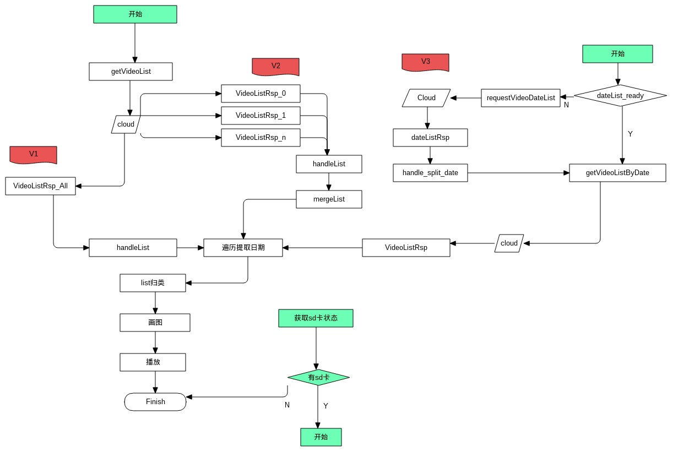

### 历史录像加载
先看大体流程



逻辑简单，一目了然。详细一看，整个流程需要考虑非常多的细节。交互上的可操作性，就需要看产品经理怎么去定夺了。

历史录像列表问题也是一个历史的问题，几个月前，海思设备上市，才被意识到问题的紧迫性，因为海思设备带了128GB的存储空间，不能按照以前的方式，加载所有列表数据回来了。

```
1.录像列表大的问题
2.不是按需查的问题
3.交互设计上的问题
```

亡羊补牢，为时不晚。终于迎来了可以按需查询的方案，我们不成文的目标是，在30s内显示历史录像就不追究。下面讨论的是V3版本的历史录像列表。

先看看这种数据结构
```
//解释一下：一天有24*60分钟，24*60/8 = 180 个字节。
//这下好了，一天的数据可以用180个字节表示，相比以前的字符串形式：24*60*n个字符串，压缩率至少一个数量级。谁提出来的，可以去申请奖金了。
[
[0,0],
[128,10],
[34,1],
[255,0],
...
]

```

这样的消息结构有哪些问题呢？
```
1.小内存设备没有索引，实时遍历，也没有好的算法，非常慢
2.序列化，和反序列化需要时间。
3.可维护性，只有机器能够读得懂
4.鲁棒性，别说了。。。
5.可测试性，没有
```

客户端反序列化这些二进制数
```
//原理：转化出 180*8个字符的字符串。为了提取连续的1,从而压缩历史录像。
    private static String flatBitList(List<DpMsgDefine.Unit> unitList) {
        PerformanceUtils.startTrace("flatBitList");
        LinkedList<DpMsgDefine.Unit> list = new LinkedList<>(unitList);
        Collections.reverse(list);
        //
        StringBuilder builder = new StringBuilder();
        for (DpMsgDefine.Unit unit : list) {
            builder.append(reverse(flatIntTo8bitStr(unit.video)));
        }
        PerformanceUtils.stopTrace("flatBitList");
        return builder.toString();
    }
```

### 辛苦了各位，革命尚未成功，期待最终版的录像方案。