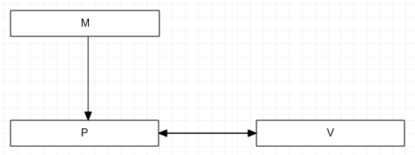
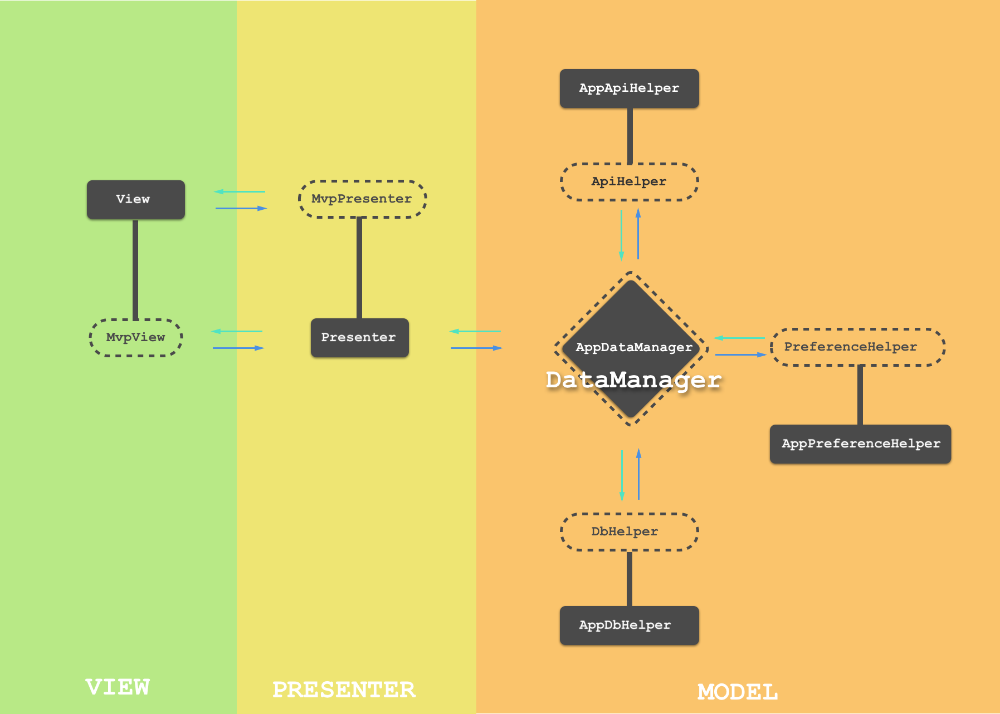
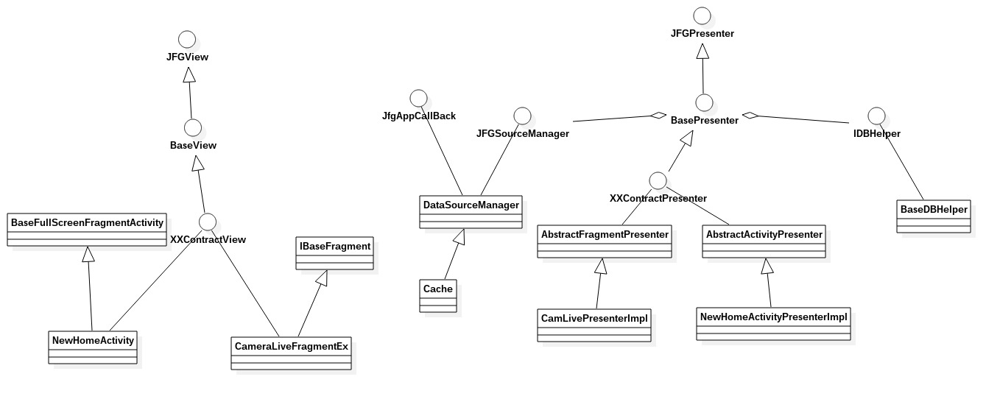
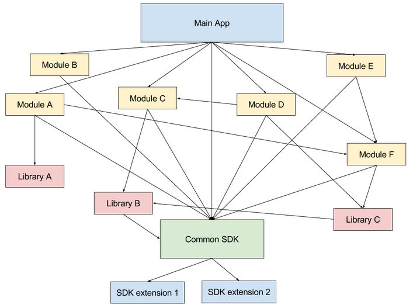

### JFGAndroid工程结构

很简单的MVP模型


再看抽象的（原图是github的某个工程）


还有一张图


MVP只是解决了分层的问题，相对于经典的MVC模型。他们的区别看[这里](https://stackoverflow.com/questions/2056/what-are-mvp-and-mvc-and-what-is-the-difference)

上面简单的MVP模型还存在巨大的耦合问题。这里的耦合是从模块来说的。


后期的工作重点就是要把模块独立开来

```
1.消息结构需要统一，msgpack和json，目前开发，测试与维护成本大于带宽成本，得不偿失。
2.sdk端需要拆分业务：多媒体模块，消息加密传输模块。
3.App层：不可模块测试，不可单元测试，不可接口测试。问题严重。
```